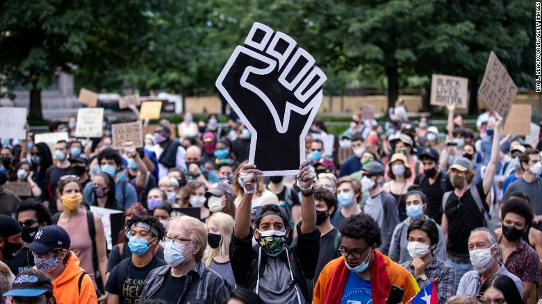

# Assignment 1: Protests
The past few years in the United States, there has been a surge in protests in support of Black Lives Matter, gender equity, and other social issues. In this assignment, you'll work with data from [CountLove](https://countlove.org/) -- the same data often [cited](https://www.nytimes.com/2020/08/28/us/black-lives-matter-protest.html) by the New York Times -- to learn more about demonstrations over the past few years. 

By completing the assignment, you will demonstrate the following skills:

- Use of **version control** for managing your code
- Declaring document rendering using **markdown** syntax
- Foundational programming skills in R. 

## Background Research
Before diving into this (or any) dataset, it's important to have _domain familiarity_ (i.e., to know something about the topic). As preparation, I'm asking that you read **three articles** about protests in the U.S., and provide a brief 1 - 2 sentence summary or takeaway from each one. 

In the section below, create an **unordered list** of the three articles you found. Make sure to provide an appropriate markdown link (_not_ just the URL) to the article in addition to your 1 - 2 sentence summary. 

+ [Pandemics and Protests: America Has Experienced Racism Like This before](https://www.brookings.edu/blog/how-we-rise/2021/06/09/pandemics-and-protests-america-has-experienced-racism-like-this-before/)
+ This article talks about the murder of George Floyd and the following protests, which a case that help to define the systemic racism as public health crisis. 

+ [Why is the world protesting so much? A new study claims to have some answers](https://www.washingtonpost.com/world/2021/11/04/protests-global-study/) 
+ This article analyzed that the behavior of protest is a way to show the democracy. 

+ [Why are there so many protests across the globe right now?](https://www.washingtonpost.com/opinions/global-opinions/why-are-there-so-many-protests-across-the-globe-right-now/2019/10/24/5ced176c-f69b-11e9-ad8b-85e2aa00b5ce_story.html)
+ This article is tending to summary the reasons that cause the protects include the economic slowdown and political shift.

## Accompanying Image 
In this section, please **display one image** to accompany your text, and describe _why_ you included it (~2 - 3 sentences). This will require that you download an image into your project folder. In your description, use **bold** and _italics_ (at least once, for practice) to emphasize some of your points.

Please don't think people who join the protests are neural. 
Most people are joining the protests for **JUSTICE**. 

## Analysis
At this point, you should open up your `analysis.R` script to begin working with the data. The script will guide you through an initial analysis of the data. Throughout the script, there are prompts labeled **Reflection**. Please write 1 - 2 sentences for each of these reflections below:

- What does the difference between the mean and the median tell you about the *distribution* of the data?

The difference between the mean and median implies that the shape of the data distribution
is negatively skewed.

- Does the number of protests in Washington surprise you? Why or why not?

Not really surprise. The proportion of protests occured in Washington is 0.036，
it is very low. I am not surprised because I barely hear that there is any protests
in WA :).

- Looking at the `state_table` variable, what data quality issues do you notice, and how would you use that to change your analysis (no need to actually change your analysis)?

The table contains the state and frequency, but the prefix of the state contains either
uppercase and lowercase. I think that it needs to be fixed by using str_to_lower() or str_to_upper().

- Does the change in the number of protests from 2019 to 2020 surprise you? Why or why not?

The ratio of the number of protests in 2020 comparted to 2019 is 0.89. Even though
it means that the protests has been decreased, it somehow surprise me because I thought
that the number of protests in 2020 should largely decrease due to the 
pandemic. And I thought that the ratio should be smaller than that. 

- Do a bit of research. Find at least *two specific policies* that have been changed as a result of protests in 2020. These may be at the city, state, or University level. Please provide a basic summary, as well as a link to each article.

[Duty to intervene:](https://www.usatoday.com/in-depth/news/2020/06/18/2020-protests-impact-city-and-state-changes-policing/5337751002/) Some law enforcement agencies, mostly in smaller cities, 
will now require officers to intervene when seeing other authorities using excessive force.

[Ban on crowd control agents:](https://ballotpedia.org/Changes_to_policing_policy_in_the_states_and_100_largest_cities,_2020) The law prohibited law enforcement agencies from using impact projectiles 
and chemical agents or irritants, including pepper spray and tear gas, 
before announcing that they would do so and giving time to for the people 
to leave during protests and demonstrations.

- Take a look (`View()`) your `high_level_table` variable. What picture does this paint of the U.S.?

The major reason that is triggering the protests in US is racial injustice.

## Critical Reflection
Now that you have had time to work with the data and visualize it, I want you to practice thinking critically about the dataset we provided. An important part of data analysis is reflecting on the assumptions, limitations, and gaps in your datasets. Remember that all datasets have to make assumptions and not all assumptions are bad or unreasonable! Practicing these skill will help you in your career to be self critical and ethically alert.

For this section, please write 2-3 sentences for each of the reflections below:

- How was the dataset collected and who collected the data? 

This dataset is collected by Nathan and Tommy. They kept a record of American dissent over this time period by reading local news reports and counted 27,270 protests across 4,042 cities.

- What assumptions does the dataset make? List at least two assumptions you identified. For inspiration, check out this [blog post](https://towardsdatascience.com/check-your-assumptions-about-your-data-20be250c143) that describes one method for identifying data assumptions.   

Assumption 1: Since the protests can be nationwide, the location and date may be overlapped in this dataset, there are records duplicated in this dataset.

Assumption 2: It is hard to identify whether the protest is curated, so the _"curated"_ section in 
this dataset may be not accurate. 

- What data is missing from the dataset? Think about if there are any data points you would have liked to have seen in the dataset. 

It will be good to add the average age for each protest in the dataset. It will help to generate the overall age in protests. I would like to know the age interval between people who participate in protests.

## Final Thoughts
When you are finished, with your analysis, please answer the following questions in 1-2 sentences each. 

- What about the analysis surprised you? 

I am not very surprised about the analysis since I have getten lots of news about the protests when some events happen. 

- What parts of this analysis did you find challenging? 

I think that analyzing the purposes is hard since the provided data are long and the formats are different. 

- What types of analysis do you wish you were able to do with the dataset, but currently don't have the technical skills to do?

I would like to use this dataset to figure out the articles by searching the location and date. 
